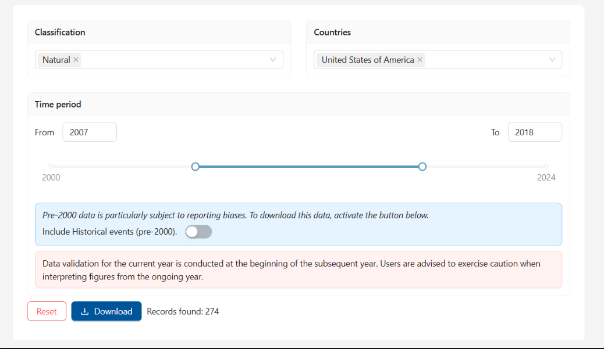

# A Project in Collaboration with Square Management Consulting

## Project Overview

This project focuses on building a predictive model to assess credit risk by determining whether a borrower can repay a loan. The project incorporates borrower-level financial data along with external climate and catastrophe indicators to analyze the impact of environmental factors on loan repayment. Below is a detailed step-by-step outline of the project:

---

### 1. Data Preprocessing

---

### 2. Baseline Model Development
- Built initial predictive models using only the borrower financial data.
- **Logistic Regression**:
  - Implemented with default parameters and evaluated performance on accuracy, precision, recall, and F1-score.
- **Random Forest**:
  - Trained with default parameters to establish a more complex baseline model.

---

### 3. Integration of Climate and Catastrophe Factors
- Integrated external climate data to assess its impact on credit risk prediction.
- Re-applied preprocessing and feature engineering to the merged dataset.
- Developed a second **Random Forest model** using the combined data to compare performance with the baseline model.

---

### 4. Model Evaluation and Comparison
- Evaluated both models (with and without climate factors) using:
  - **Accuracy**: Overall correctness of predictions.
  - **Precision and Recall**: Focused on identifying high-risk loans (minority class).
  - **F1-Score**: Balance between precision and recall.
- Observed that integrating climate factors slightly improved precision and recall for identifying high-risk borrowers.

---

### 5. Insights and Future Directions
- **Insights**:
  - Climate factors provided marginal improvements in identifying high-risk loans, highlighting their potential value in credit risk modeling.
- **Future Directions**:
  - Conduct **feature importance analysis** to determine which climate indicators contribute most to prediction.
  - Use advanced models like Gradient Boosting (e.g., XGBoost, LightGBM) for better handling of complex interactions.
  - Implement hyperparameter tuning for both models to further enhance performance.
  - Explore additional external datasets to enrich the model.

---

### 6. Conclusion
This project demonstrates the feasibility of integrating climate data into credit risk models, offering insights into how external environmental factors can influence loan repayment. By leveraging both internal financial data and external climate indicators, this approach can help banks make better-informed lending decisions, manage risk more effectively, and align with sustainability goals.

---
## Library Dependencies

This project relies on specific versions of key libraries to ensure compatibility and functionality. Below are the versions used in this project:

- **Pandas**: 2.2.2  
- **Numpy**: 1.26.4  
- **Scikit-learn**: 1.5.1  
- **Matplotlib**: 3.9.2  
- **Seaborn**: 0.13.2  
- **Scipy**: 1.13.1

## Getting Climate Data : 

Apply these filters on the EM DATA website 

